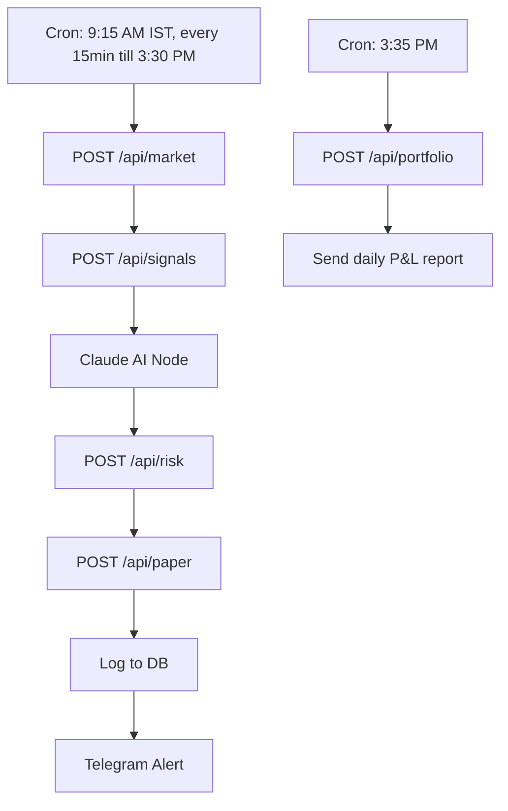

# n8n + Backend Architecture

This document explains how to use n8n as the orchestrator for your trading workflow, leveraging your existing FastAPI endpoints.

## Overview
- **n8n** acts as the scheduler and orchestrator.
- All trading logic remains in your backend.
- n8n glues together API calls, reasoning, and alerts.

## Workflow

## Steps
1. **n8n Cron Scheduler**
   - Triggers at 9:15 AM IST, every 15min till 3:30 PM.
2. **POST /api/market**
   - Fetches latest prices from your backend.
3. **POST /api/signals**
   - Runs strategy and ML models.
4. **Claude AI Node**
   - Validates signal, adds reasoning.
5. **POST /api/risk**
   - Checks position sizing and stop loss.
6. **POST /api/paper**
   - Places paper trade.
7. **Log to DB**
   - Already handled by backend.
8. **Telegram Alert**
   - Uses alerts/telegram.py for notifications.
9. **End-of-Day Cron (3:35 PM)**
   - POST /api/portfolio to send daily P&L report.

## Benefits
- No need to rewrite backend logic.
- Flexible, visual orchestration with n8n.
- Easily extendable for new workflows or integrations.

---
See backend and claude_docs for endpoint details.